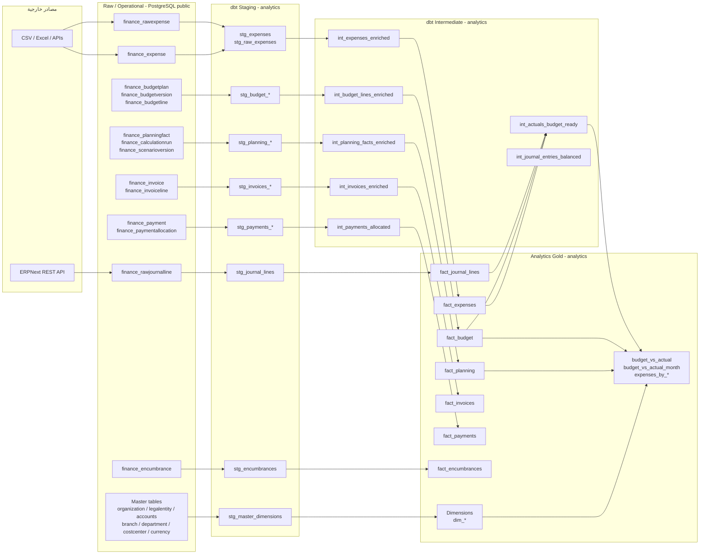
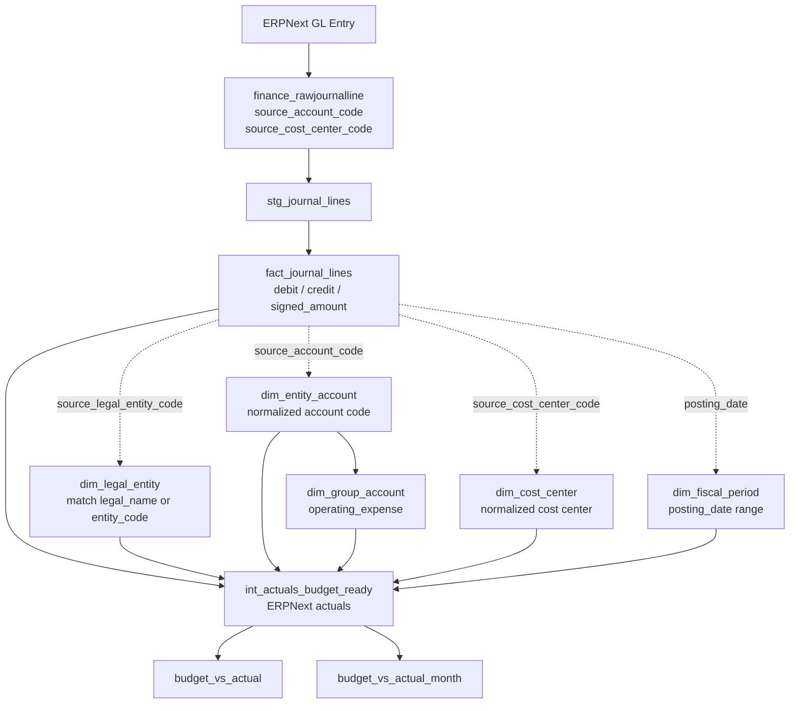
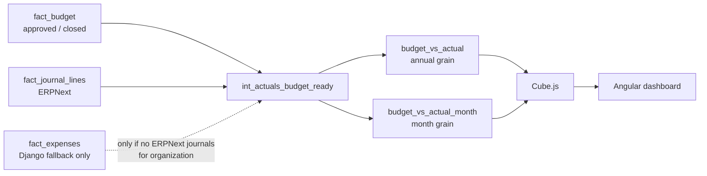

# مخطط علاقات البيانات: Raw وFacts وDimensions

هذه الوثيقة تشرح المسار الفعلي للبيانات في Finance Budgeting Stack. الرسم لا
يعني أن جداول `raw` و`analytics` في schema واحدة؛ Django يكتب في `public`،
بينما dbt ينشر الجداول التحليلية في `analytics`.

## 1. المسار العام للطبقات



### معنى الأسهم

- السهم من `raw` إلى `stg` يعني تنظيف الأنواع وتمرير metadata، وليس تجميعًا
  ماليًا.
- السهم من `stg` إلى `int` يعني business joins أو effective dating أو كشف
  الاتساق.
- السهم من `int` إلى `fact` يعني تثبيت grain تحليلي.
- الـ dimensions تصف facts ولا تستبدل جداول Django التشغيلية.
- الـ marts مخرجات جاهزة لـ Cube والـ dashboard، وليست مصدر الحقيقة التشغيلي.

## 2. العلاقات الأساسية بين Facts وDimensions

```mermaid
erDiagram
    DIM_ORGANIZATION ||--o{ DIM_LEGAL_ENTITY : contains
    DIM_ORGANIZATION ||--o{ DIM_GROUP_ACCOUNT : owns
    DIM_ORGANIZATION ||--o{ FACT_BUDGET : scopes
    DIM_ORGANIZATION ||--o{ FACT_EXPENSES : scopes
    DIM_ORGANIZATION ||--o{ FACT_PLANNING : scopes

    DIM_LEGAL_ENTITY ||--o{ DIM_ENTITY_ACCOUNT : defines
    DIM_LEGAL_ENTITY ||--o{ DIM_BRANCH : owns
    DIM_LEGAL_ENTITY ||--o{ DIM_DEPARTMENT : employs
    DIM_LEGAL_ENTITY ||--o{ DIM_COST_CENTER : owns
    DIM_LEGAL_ENTITY ||--o{ FACT_BUDGET : scopes
    DIM_LEGAL_ENTITY ||--o{ FACT_EXPENSES : scopes
    DIM_LEGAL_ENTITY ||--o{ FACT_PLANNING : scopes

    DIM_GROUP_ACCOUNT ||--o{ DIM_ENTITY_ACCOUNT : maps_to
    DIM_GROUP_ACCOUNT ||--o{ FACT_BUDGET : classifies
    DIM_GROUP_ACCOUNT ||--o{ FACT_EXPENSES : classifies
    DIM_GROUP_ACCOUNT ||--o{ FACT_PLANNING : classifies

    DIM_ENTITY_ACCOUNT ||--o{ FACT_BUDGET : posts_to
    DIM_ENTITY_ACCOUNT ||--o{ FACT_EXPENSES : posts_to

    DIM_BRANCH ||--o{ FACT_BUDGET : scopes
    DIM_BRANCH ||--o{ FACT_EXPENSES : scopes
    DIM_BRANCH ||--o{ FACT_PLANNING : scopes

    DIM_DEPARTMENT ||--o{ FACT_BUDGET : scopes
    DIM_DEPARTMENT ||--o{ FACT_EXPENSES : scopes
    DIM_DEPARTMENT ||--o{ FACT_PLANNING : scopes

    DIM_COST_CENTER ||--o{ FACT_BUDGET : scopes
    DIM_COST_CENTER ||--o{ FACT_EXPENSES : scopes

    DIM_FISCAL_PERIOD ||--o{ FACT_BUDGET : period
    DIM_FISCAL_PERIOD ||--o{ FACT_PLANNING : period
    DIM_DATE ||--o{ FACT_EXPENSES : expense_date
    DIM_DATE ||--o{ FACT_JOURNAL_LINES : posting_date

    DIM_SCENARIO_VERSION ||--o{ FACT_PLANNING : version
    DIM_CURRENCY ||--o{ FACT_BUDGET : currency
    DIM_CURRENCY ||--o{ FACT_EXPENSES : currency
    DIM_CURRENCY ||--o{ FACT_PLANNING : currency

    DIM_ORGANIZATION {
        bigint organization_id PK
        string organization_code
    }
    DIM_LEGAL_ENTITY {
        bigint legal_entity_id PK
        bigint organization_id FK
        string entity_code
    }
    DIM_GROUP_ACCOUNT {
        bigint group_account_id PK
        bigint organization_id FK
        string group_account_code
    }
    DIM_ENTITY_ACCOUNT {
        bigint entity_account_id PK
        bigint legal_entity_id FK
        bigint group_account_id FK
        string entity_account_code
    }
    DIM_BRANCH {
        bigint branch_id PK
        bigint legal_entity_id FK
        string branch_code
    }
    DIM_DEPARTMENT {
        bigint department_id PK
        bigint legal_entity_id FK
        string department_code
    }
    DIM_COST_CENTER {
        bigint cost_center_id PK
        bigint legal_entity_id FK
        string cost_center_code
    }
    DIM_FISCAL_PERIOD {
        bigint fiscal_period_id PK
        bigint fiscal_calendar_id FK
        string fiscal_period_code
        date start_date
        date end_date
    }
    DIM_DATE {
        integer date_key PK
        date date_day
        integer month_key
    }
    DIM_SCENARIO_VERSION {
        bigint scenario_version_id PK
        bigint scenario_id FK
        string scenario_version_code
    }
    DIM_CURRENCY {
        bigint currency_id PK
        string currency_code
    }

    FACT_BUDGET {
        bigint budget_line_id PK
        bigint organization_id FK
        bigint legal_entity_id FK
        bigint fiscal_period_id FK
        bigint group_account_id FK
        bigint entity_account_id FK
        bigint branch_id FK
        bigint department_id FK
        bigint cost_center_id FK
        decimal amount
        string currency_code
    }
    FACT_EXPENSES {
        bigint expense_id PK
        bigint organization_id FK
        bigint legal_entity_id FK
        bigint group_account_id FK
        bigint entity_account_id FK
        bigint branch_id FK
        bigint department_id FK
        bigint cost_center_id FK
        integer date_key FK
        decimal amount
        string currency_code
    }
    FACT_PLANNING {
        bigint planning_fact_id PK
        bigint organization_id FK
        bigint scenario_version_id FK
        bigint fiscal_period_id FK
        bigint legal_entity_id FK
        bigint group_account_id FK
        bigint branch_id FK
        bigint department_id FK
        decimal planned_amount
    }
    FACT_JOURNAL_LINES {
        bigint journal_line_id PK
        bigint ingestion_run_id FK
        string source_system
        string source_account_code
        string source_cost_center_code
        integer date_key FK
        decimal debit_amount
        decimal credit_amount
        decimal signed_amount
    }
```



## 3. مسار actuals من ERPNext

`fact_journal_lines` هو fact خام تحليلي للقيود المستوردة؛ يحتفظ بأكواد ERPNext
كما وردت من المصدر. لا يحتوي هذا الجدول وحده على `group_account_id` أو
`branch_id` موحدين.



### ملاحظة الفرع

القيد القادم من ERPNext قد يحتوي `source_cost_center_code` مثل `Main - FDD`
بدل branch مستقل. إذا لم يوجد mapping لهذا الـ cost center إلى `dim_branch`,
سيبقى `branch_id` و`branch_code` فارغين في المقارنة. لا توزع actual على فرع
اعتباطيًا.

## 4. Budget مقابل Actual



القواعد المحاسبية الحالية:

- `ERPNext` هو مصدر actuals التشغيلي عند وجود journals للمنظمة.
- `finance_expense` ذو `source_system = 'django'` fallback تطويري فقط.
- لا يجوز جمع ERPNext وDjango demo لنفس المنظمة، لمنع double counting.
- budget الشهري يوزع بالتساوي على أشهر الفترة لأن `BudgetLine` الحالي لا يحمل
  شهرًا؛ الشهر الأخير يأخذ remainder الحسابي حتى يتطابق المجموع السنوي.

## 5. قائمة الجداول الأساسية

### Raw / Operational في `public`

```text
finance_rawjournalline
finance_rawexpense
finance_expense
finance_budgetplan
finance_budgetversion
finance_budgetline
finance_planningfact
finance_calculationrun
finance_scenarioversion
finance_invoice
finance_invoiceline
finance_payment
finance_paymentallocation
finance_encumbrance
finance_organization
finance_legalentity
finance_fiscalperiod
finance_groupaccount
finance_entityaccount
finance_branch
finance_department
finance_costcenter
finance_currency
```

### Facts في `analytics`

```text
fact_journal_lines
fact_expenses
fact_budget
fact_planning
fact_invoices
fact_payments
fact_encumbrances
fact_planning_driver_values
```

### Dimensions في `analytics`

```text
dim_organization
dim_legal_entity
dim_fiscal_period
dim_date
dim_group_account
dim_entity_account
dim_branch
dim_department
dim_cost_center
dim_profit_center
dim_business_unit
dim_project
dim_currency
dim_country
dim_supplier
dim_customer
dim_tax_code
dim_budget_version
dim_scenario
dim_scenario_version
```

### Marts وطبقة الاستهلاك

```text
budget_vs_actual
budget_vs_actual_month
expenses_by_branch
expenses_by_month
expenses_by_branch_month
reconciliation_budget
reconciliation_planning
```

## 6. قواعد تعديل المخطط

عند إضافة عمود foreign key إلى fact أو dimension:

1. مرره من `stg` إلى `int` ولا تنشئه في mart فقط.
2. أضف dimension join في المارت إذا كان مطلوبًا للعرض.
3. أضف `not_null` أو `relationships` عندما يكون الحقل إلزاميًا.
4. حدّث grain test إذا أصبح العمود جزءًا من grain.
5. حدّث Cube contract وواجهة Angular إذا أصبح البعد قابلًا للعرض.
6. شغّل `dbt build --full-refresh` وتحقق من عدم مضاعفة الصفوف.

لا تربط Cube مباشرة بجداول `public` أو `raw`. المصدر الوحيد لـ Cube هو
`analytics`.