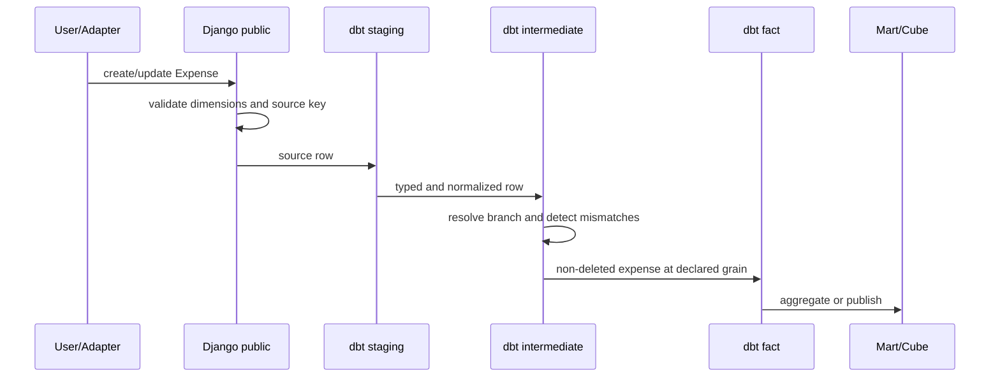

# ملكية البيانات والتتبع

هذه الوثيقة تحدد أين يتخذ القرار وأين يعاد تشكيله تحليليًا.

## 1. مصفوفة الملكية

| القرار أو البيانات | المالك | التخزين | المستهلك |
|---|---|---|---|
| تعريف المنظمة والكيان والحساب | Django | `public.finance_*` | Django + dbt staging/dim |
| إدخال مصروف أو ميزانية | Django | `public.finance_*` | dbt facts |
| قاعدة حساب أو allocation | Django | `public.finance_*` | worker ومحرك Django ثم dbt |
| حالة اعتماد أو submission | Django | `public.finance_*` | workflow/API وreconciliation |
| صلاحية مستخدم ونطاقه | Django | `public.finance_role*` | API/semantic security |
| تنظيف وربط source rows | dbt | `analytics.stg_*` / `int_*` | facts والمarts |
| fact مالي قابل لإعادة البناء | dbt | `analytics.fact_*` | Cube والتقارير |
| snapshot تقرير ثابت | Django أو object storage | metadata في public | audit/board pack |
| نتيجة توحيد منشورة | dbt بعد نجاح run | `analytics` | Cube والتقارير الموحدة |

## 2. دورة حياة المصروف



القواعد:

- `source_system + source_entity + source_record_id` هو مفتاح التتبع عندما يتوفر.
- `expense_id` مفتاح تشغيل داخلي، وليس بديلًا عن source lineage.
- `record_hash` يساعد في كشف التغيير وإعادة المعالجة.
- `is_deleted` لا يحذف الأثر من المصدر؛ يحدد ظهور السجل في fact الحالي.
- فشل الربط لا يخفي الصف بصمت؛ يذهب إلى exception أو يفشل refresh حسب السياسة.

## 3. دورة حياة التخطيط

```text
Scenario / Version / Rules / Drivers
              ↓ Django
       CalculationRun
              ↓ worker
       PlanningFact + lineage
              ↓ dbt
       fact_planning / scenario_blended_budget
              ↓
       budget_vs_actual / reporting marts
```

`CalculationRun` يملك الحالة والـ input snapshot. `PlanningFact` يحتفظ بالنتيجة التشغيلية وlineage عند الحاجة. dbt ينشر الإسقاط التحليلي ولا يعيد تفسير expression أو graph القواعد.

## 4. دورة حياة الميزانية

```text
BudgetPlan
  -> BudgetVersion
      -> BudgetLine
          -> stg_budget_lines
              -> int_budget_lines_enriched
                  -> fact_budget
                      -> budget_vs_actual
```

لا يتم تعديل النسخة المعتمدة مباشرة. أي تعديل جوهري ينشئ version جديدة، ويجب أن يحتفظ التحليل بمفتاح النسخة والسيناريو والفترة.

## 5. قواعد الانتقال بين الطبقات

| من | إلى | شرط الانتقال |
|---|---|---|
| Django source | staging | source table موجودة وschema موثق |
| staging | intermediate | types وsource keys صالحة |
| intermediate | fact | grain uniqueness وforeign keys وpolicy الحذف واضحة |
| fact | mart | العملة والفترة والأبعاد قابلة للمقارنة |
| run | report | run ناجح وsnapshot أو model lineage موثق |
| workflow | security | القرار الأمني يبقى في Django/API، لا في dbt |

## 6. معرفات التتبع القياسية

كل نموذج تحليلي يحتاج، حسب طبيعته، إلى أكبر قدر ممكن من الآتي:

```text
source_system
source_entity
source_record_id
record_hash
source_created_at
source_updated_at
ingested_at
created_at
updated_at
calculation_run_id
scenario_version_id
budget_version_id
```

لا تستخدم الاسم أو الكود وحده كـ foreign key تحليلي. الأكواد تصلح للعرض والمطابقة، أما العلاقات فبالمعرفات.

## 7. مراجعة التغيير

عند تعديل Django model:

1. افحص migration واسم جدول المصدر.
2. حدّث `sources.yml` إذا أضيف جدول.
3. حدّث staging contract والـ fields.
4. حدّث intermediate وfact grain إن تغير.
5. أضف tests للعلاقة والـ uniqueness والحذف.
6. راجع Cube أو dashboard إذا تغير اسم أو grain.
7. شغّل `manage.py check`, `makemigrations --check`, و`dbt build` للمسار المتأثر.

عند تعديل dbt model:

1. لا تغير معنى الصف دون تحديث grain في الوثيقة.
2. لا تغير measure أو dimension دون تحديث Cube.
3. احتفظ بمسار `full-refresh` للاسترجاع.
4. اختبر reconciliation قبل إعلان refresh ناجح.
