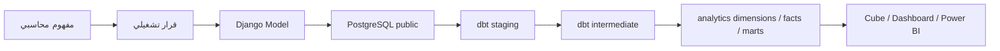

# جسر المجال المحاسبي والتصميم التقني

هذا المجلد هو الطبقة المعرفية بين لغة المحاسبة وتصميم المنصة. يربط كل مفهوم مالي بمالكه التشغيلي في Django، وبإسقاطه التحليلي في dbt، مع توضيح الحبيبة والحدود والمسؤولية.

## مسار القراءة

1. [قاموس المجال](DOMAIN_GLOSSARY_AR.md): معنى المفاهيم المحاسبية قبل النظر إلى الجداول.
2. [خريطة Django](DOMAIN_TO_DJANGO_AR.md): أين تُنشأ وتُعدل البيانات التشغيلية.
3. [خريطة dbt](DOMAIN_TO_DBT_AR.md): كيف تتحول المصادر إلى أبعاد وfacts وmarts.
4. [ملكية البيانات والتتبع](DATA_OWNERSHIP_AR.md): من يملك كل قرار ومتى تنتقل البيانات بين الطبقات.
5. [ERPNext كمصدر تجريبي](ERPNext_DEMO_COMPOSE_AR.md): تشغيل المصدر الخارجي واختبار REST ومسار GL Entry.
6. [مخطط علاقات البيانات](DATA_MODEL_DIAGRAM_AR.md): علاقات raw وstaging وintermediate وfacts وdimensions والـ marts.

## المعمارية

## القاعدة الأساسية

- Django هو مصدر الحقيقة للبيانات القابلة للتحرير، والقيود التشغيلية، وسير الموافقات، والصلاحيات.
- dbt هو مالك الإسقاطات القابلة لإعادة البناء، والتجميعات، وfacts التحليلية.
- PostgreSQL هو التخزين الفيزيائي في الطبقتين؛ الفرق هو schema والمالك ودورة الحياة.
- لا يستخدم dbt لتقرير صلاحية المستخدم أو تعديل القيود التشغيلية.
- لا تستخدم جداول Django التشغيلية مباشرة كمصدر للتقارير النهائية.

## معيار كل خريطة

كل ربط في الوثائق يوضح:

- المفهوم المحاسبي.
- Django model وجدول المصدر.
- dbt source/staging/intermediate/fact أو سبب عدم وجود إسقاط.
- grain، والمفتاح، وحالة التنفيذ.
- مالك التغيير والاختبارات المطلوبة.

## مصادر التنفيذ

- نماذج Django: [django/finance/models](../django/finance/models/__init__.py)
- عقد dbt: [DBT_MODEL_REQUIREMENTS_AR.md](../DBT_MODEL_REQUIREMENTS_AR.md)
- دليل المجال الحالي: [FINANCE_DOMAIN_GUIDE_AR.md](../FINANCE_DOMAIN_GUIDE_AR.md)
- تصميم COA: [CHART_OF_ACCOUNTS_GROUP_DESIGN_AR.md](../CHART_OF_ACCOUNTS_GROUP_DESIGN_AR.md)

## تحديث الوثائق

عند إضافة مفهوم أو جدول جديد، حدّث بالترتيب:

1. قاموس المجال.
2. خريطة Django أو قرار أن المفهوم ليس تشغيليًا.
3. خريطة dbt والـ grain والاختبارات.
4. سياسة الملكية والتتبع.
5. عقد Cube إذا تغير اسم measure أو dimension.
